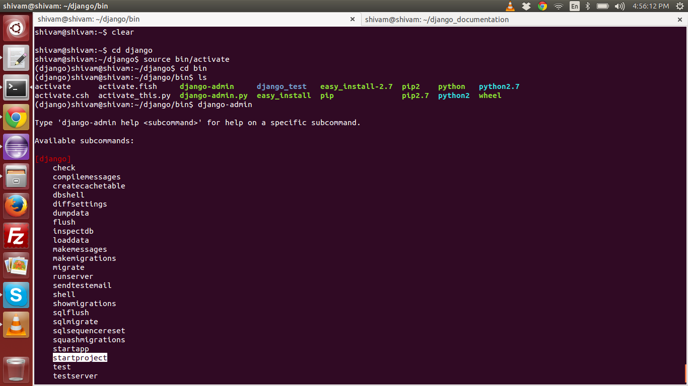

.. highlight:: rst

Creating Django Project
=======================

- Goto the virtual environment folder and activate the environment

- Now goto `bin` folder and you will find file name `django-admin`

- Just type the name of the file and press enter to display the commands available to you

- Amongst them there will be command `startproject`. This will help you create a project

Following is the text of the screenshot

::

	shivam@shivam:~$ cd django
	shivam@shivam:~/django$ source bin/activate
	(django)shivam@shivam:~/django$ cd bin
	(django)shivam@shivam:~/django/bin$ ls
	activate      activate.fish     django-admin     django_test   easy_install-2.7  pip2    python   python2.7
	activate.csh  activate_this.py  django-admin.py  easy_install  pip               pip2.7  python2  wheel
	(django)shivam@shivam:~/django/bin$ django-admin

	Type 'django-admin help <subcommand>' for help on a specific subcommand.

	Available subcommands:

	[django]
	    check
	    compilemessages
	    createcachetable
	    dbshell
	    diffsettings
	    dumpdata
	    flush
	    inspectdb
	    loaddata
	    makemessages
	    makemigrations
	    migrate
	    runserver
	    sendtestemail
	    shell
	    showmigrations
	    sqlflush
	    sqlmigrate
	    sqlsequencereset
	    squashmigrations
	    startapp
	    `startproject`
	    test
	    testserver
	
